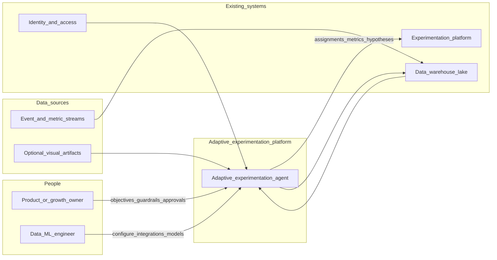
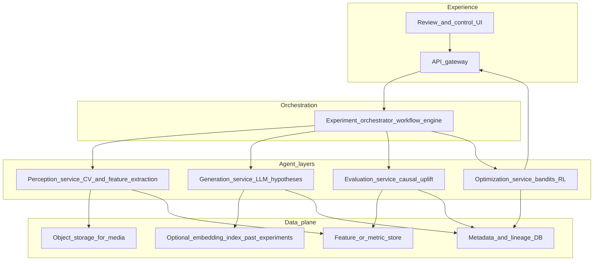

# Recommended architecture: Adaptive experimentation agent

This document implements the analysis and architecture deliverable for [Dell_Idea Outline_Team X.pdf](Dell_Idea%20Outline_Team%20X.pdf).

**See also:** [DATA_SOURCES_AND_TOOLS.md](DATA_SOURCES_AND_TOOLS.md) for data sources and tooling choices aligned with this design.

---

## 1. Requirements extracted from the outline

### Problem and goal

- **Problem**: Organizations running experiments in **complex, high-dimensional** environments (e.g., game configuration, marketing mix) cannot turn test results into the **next best decision** quickly enough.
- **Direction**: Move from **static, manual A/B** design toward **adaptive systems** that continuously **explore, evaluate, and optimize** in large parameter spaces.
- **Differentiator (stated gap)**: A closed loop **without Tencent-scale overhead**—**LLM hypothesis generation + causal evaluation + bandit-style policy updates**, implemented as **composable skills** on **standard experimentation infrastructure**.

### Prioritized use case (from your framework)

- **Adaptive marketing experimentation** is called out as high priority: high decision frequency, large combinatorial space (channels, creatives, targeting), strong data availability from existing experimentation systems, clear speed/quality upside.
- The deck also anchors a **gaming configuration** narrative (Lightspeed-style config tables, retention/monetization).

*Architecture below supports both marketing and game-config domains by parameterizing “decision units” and metrics.*

### Stakeholders and journeys (inferred)

| Actor | Journey |
|-------|--------|
| **Experimentation / growth owner** | Define objectives and guardrails → review agent-proposed hypotheses → approve launches → read impact summaries. |
| **Data / ML engineer** | Connect data sources, validate pipelines, tune causal and bandit models, monitor drift. |
| **Product / game PM** | Translate business goals into reward metrics and constraints (e.g., difficulty bounds). |

### Data inputs (from outline)

- **Structured**: experiment logs (A/B, configs), player or user metrics (retention, engagement, spend), game or campaign parameters.
- **Behavioral**: interaction events (clicks, sessions, progression).
- **Visual (optional layer)**: gameplay or UI recordings, screen captures, layout signals—converted to structured features in a **perception** stage.

### Outputs (from outline)

- Optimized configurations (levels, rewards, UI, or marketing levers).
- Continuous updates to **decision policies** (not one-off reports).
- Predicted impact on north-star metrics (e.g., retention, monetization).
- Ranked **next-best experiments** under exploration budget.

### Non-functional requirements (inferred)

- **Composable skills**: Swappable modules (perception, generation, evaluation, optimization) behind clear interfaces.
- **Integration with existing stacks**: Prefer warehouse + experiment platform patterns (your references point to Databricks-style analytics on mobile gaming data).
- **Safety / governance**: Human approval for production-impacting changes; audit trail of who launched what and which model version proposed it.
- **Latency**: Hypothesis generation can be async; policy updates may be batch or near–real-time depending on traffic.

---

## 2. System context (C4 level 1)



---

## 3. Container architecture (C4 level 2)

Four logical layers from your deck map to **deployable services** and **data stores**. Names are implementation-agnostic; one team can start with a monorepo and split later.



### Responsibilities

| Container | Role |
|-----------|------|
| **API gateway** | AuthN/Z (SSO/OIDC), rate limits, request validation, audit logging. |
| **Review UI** | Human-in-the-loop: hypothesis queue, approvals, explanations, links to experiment tickets. |
| **Orchestrator** | Stateful workflows: ingest → perceive → generate candidates → causal shortlist → bandit allocation → write back to experiment platform. |
| **Perception** | Optional CV/NLP on visuals; always normalize to **structured features** consumable by downstream layers. |
| **Generation** | LLM + structured retrieval over past experiments/docs to propose **feasible** parameter bundles under constraints. |
| **Evaluation** | Causal inference / uplift on logged experiment data; uncertainty and multiple-testing controls. |
| **Optimization** | Contextual bandits or lightweight RL for **explore/exploit** over the candidate action space; outputs allocation or recommended next test arms. |
| **Data plane** | Durable storage for media, experiment metadata, features, and optional embeddings for RAG. |

---

## 4. Core data flow (happy path)

```mermaid
sequenceDiagram
  participant Src as Sources_events_configs
  participant DW as Warehouse
  participant Orch as Orchestrator
  participant Perc as Perception
  participant Gen as Generation
  participant Ev as Evaluation
  participant Opt as Optimization
  participant Exp as Experiment_platform
  Src->>DW: Batch_or_stream_sync
  DW->>Orch: Metrics_and_experiment_reads
  Orch->>Perc: Optional_visual_or_rich_context
  Perc->>Orch: Structured_features
  Orch->>Gen: Context_constraints_past_results
  Gen->>Orch: Candidate_hypotheses
  Orch->>Ev: Candidates_plus_historical_data
  Ev->>Orch: Ranked_expected_uplift_uncertainty
  Orch->>Opt: Feasible_arm_set_and_constraints
  Opt->>Orch: Next_allocation_or_policy_delta
  Orch->>Exp: Create_or_update_test_arms
  Exp->>DW: Outcomes_feedback
```

---

## 5. Phased delivery (MVP → full loop)

### Phase A — Foundation (fastest path to value)

- Ingest **structured** experiment logs and outcome metrics into a **single analytical layer** (warehouse or lakehouse).
- **Evaluation service (MVP)**: Off-the-shelf causal/uplift models on historical A/B data; dashboards for “what worked.”
- **Generation (lightweight)**: Templated or rules + small LLM prompts to suggest **next tests** from a constrained menu (no full autonomy).

*Outcome*: Smarter prioritization and reporting; humans still design tests—aligns with “smarter reporting” column in your gap analysis, but grounded in your causal layer.

### Phase B — Closed loop (core thesis)

- Add **Optimization service**: contextual bandit (or Thompson sampling) over a **discrete** set of arms derived by Generation + Evaluation.
- Wire **Orchestrator** to your **experimentation platform** API (create variants, traffic splits, read results).
- **Governance**: approval queues, automatic rollback rules, caps on exploration traffic.

*Outcome*: Automated “propose → measure → update policy” within guardrails.

### Phase C — Rich perception (optional, costlier)

- **Perception** pipeline for video/screenshots: feature extraction, UI friction scores, difficulty proxies—feeding Generation and Evaluation.

*Outcome*: Uses visual evidence as in your Layer 1, without blocking Phases A–B.

---

## 6. Recommended technology choices (illustrative)

Choices assume a **Python-first** ML stack and **cloud-agnostic** services; swap for Dell-approved equivalents.

| Concern | Suggested direction | Rationale |
|---------|---------------------|-----------|
| Orchestration | Temporal, Dagster, or Airflow for workflows; or FastAPI + hand-rolled state machine for a thin MVP | Explicit long-running experiment lifecycles and retries. |
| Warehouse / lake | Databricks, Snowflake, or BigQuery per org standard | Matches your cited Databricks experimentation pattern; scales SQL + ML. |
| LLM layer | Managed API with **structured output** (JSON schema) + prompt/version store | Hypothesis generation must be **constraint-safe** and auditable. |
| Causal / uplift | EconML, CausalML, or doWhy + scikit-learn; or uplift forests | Fits Layer 3; start simple, add DML as needed. |
| Bandits / RL | Vowpal Wabbit, Ray RLlib, or a small custom contextual bandit | Exploration control without heavy RL ops for MVP. |
| Perception | OpenCV + a small vision model; defer to Phase C | Cost and complexity only when visuals are must-have. |
| API / UI | FastAPI + React (or internal design system) | Common for capstone; SSO via OIDC. |

---

## 7. Risks and mitigations

- **Combinatorial explosion**: Keep **action sets** explicit and finite per wave; let bandits optimize over **hundreds** of arms, not raw full Cartesian products.
- **Confounding in observational data**: Evaluation layer must distinguish **randomized** experiment reads from observational telemetry; causal claims only where design supports them.
- **LLM safety**: Validate all generated configs against schemas; never send raw LLM output to production without checks.
- **Scope creep**: Ship Phase A→B on **one** metric family (e.g., retention or CPA) before adding vision.

---

## 8. Traceability to the PDF

| Outline element | Architecture mapping |
|-----------------|---------------------|
| Layer 1 Perception | `Perception_service`, `Object_storage`, features to `Feature_store` |
| Layer 2 Generation | `Generation_service` + optional `Embedding_index` for RAG |
| Layer 3 Evaluation | `Evaluation_service` + warehouse features |
| Layer 4 Optimization | `Optimization_service` + orchestrator feedback to `Experiment_platform` |
| “Composable skills on standard infra” | Four services behind `Orchestrator`, data in `Warehouse` / experiment platform |
| Adaptive marketing + gaming configs | Same platform; **parameter schema** and **reward definition** differ per domain |

---

## 9. Dell and enterprise alignment (fill in as constraints land)

Use this table to replace generic labels in Sections 2–3 with **approved** product names and boundaries. Nothing here assumes a specific Dell stack until your team fills the second column.

| Decision | What to confirm with IT / security | Touches in this architecture |
|----------|--------------------------------------|-------------------------------|
| **Identity** | Corporate IdP (e.g., SAML/OIDC), groups for operators vs engineers | API gateway, Review UI |
| **Data residency** | Regions where warehouse, object storage, and model endpoints may run | Data plane, LLM calls from Generation |
| **Analytics platform** | Authorized lakehouse or warehouse for experiment and event tables | Warehouse in context diagram, Evaluation inputs |
| **Experimentation system** | System of record for assignments, metrics, and lift reads | Experiment platform, Orchestrator writebacks |
| **LLM access** | Approved inference endpoint (cloud API vs private deployment), logging policy | Generation service |
| **Secrets and keys** | Vault or cloud secret manager pattern | All services |
| **Observability** | Mandatory logging/metrics/tracing stack | Orchestrator and all long-running jobs |

### “Knowledge base” vs this design

The repository folder name suggests a **document-centric** KB. In this project, the **retrieval surface** for the LLM is best thought of as a **corpus of past experiments, configs, and playbooks** (plus optional embeddings in `Optional_embedding_index_past_experiments`), not only static PDFs. If Dell also requires a classic **doc ingest → chunk → cite** path, that becomes an additional ingestion pipeline into the same embedding/metadata stores used by Generation—without changing the four-layer agent structure.

This document is the architecture deliverable for the plan; update Section 9 when stakeholder constraints (e.g., on-prem only, named Dell platforms) are fixed.
