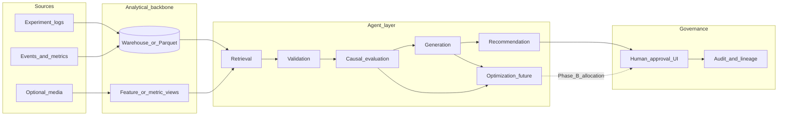
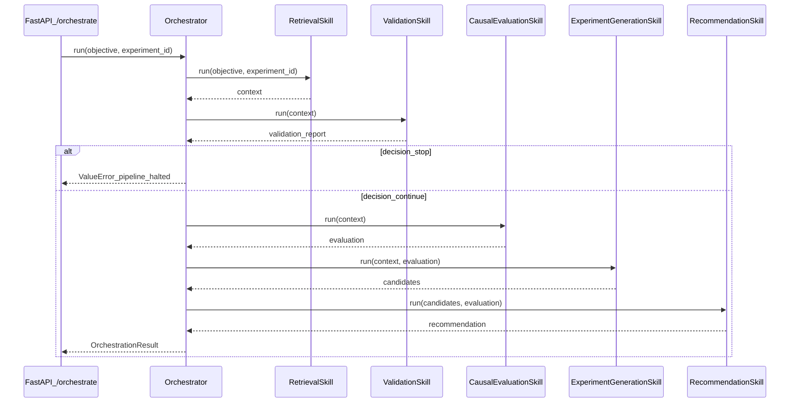
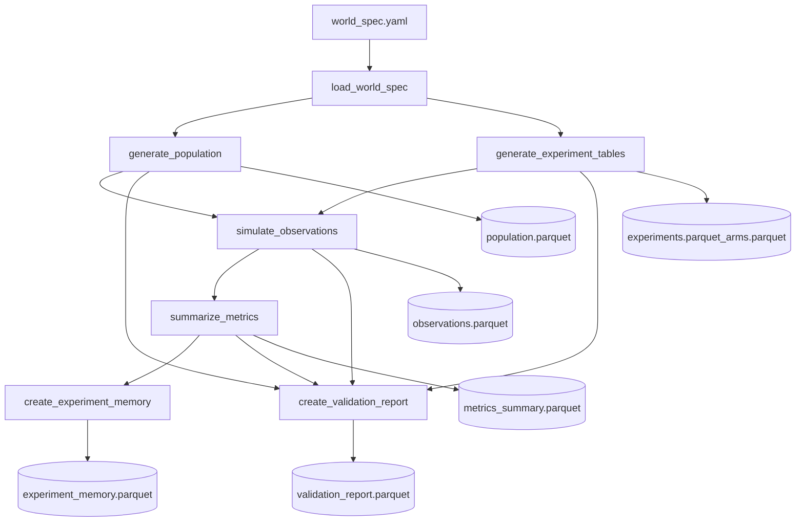
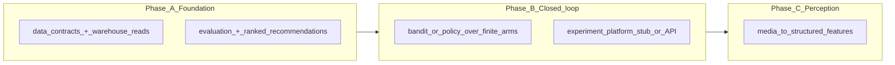

# Experimentation development plan

**Branch:** `dev/experimentation-plan` — keep all experimentation planning and aligned doc changes here until stakeholders sign off; merge to `main` or other branches only after review.

**Traceability:** This plan ties the capstone phased delivery in [`ARCHITECTURE.md`](../ARCHITECTURE.md) (Foundation → closed loop → optional perception) and the tooling/data path in [`DATA_SOURCES_AND_TOOLS.md`](../DATA_SOURCES_AND_TOOLS.md) to the concrete code layout in this repository ([`docs/architecture.md`](architecture.md), `src/`, `synthetic_env/`).

---

## 1. What “experimentation” means in this repo

- **Scientific core:** Randomized or otherwise identified treatment arms, logged outcomes, and explicit metrics so causal/evaluation claims stay defensible ([`ARCHITECTURE.md`](../ARCHITECTURE.md), evaluation and guardrails sections).
- **Engineering core:** Shared **data contracts** (`src/data/models.py`), a **skill-based orchestrator** (`src/agent/orchestrator.py`), and an optional **synthetic benchmark** pipeline to validate flows before production data (`synthetic_env/pipeline.py`).
- **Product stance (MVP):** **Recommendation-first** — `data → evaluation → recommendation` before any autonomous allocation ([`docs/architecture.md`](architecture.md) §1–2).

---

## 2. Execution phases mapped to repository work

| Phase | Intent (from capstone KB) | What to build in this repo | Primary paths / artifacts |
| ----- | --------------------------- | ----------------------------- | ------------------------- |
| **A — Foundation** | Single analytical layer for experiment logs + metrics; evaluation MVP on historical data; lightweight generation (templates / constrained LLM). | Harden contracts; replace stubs with retrieval over Parquet/SQL; real causal-style scoring in `CausalEvaluationSkill`; validation gates; wire API to real inputs; use `synthetic_env` outputs as regression fixtures. | `src/data/`, `src/skills/*`, `src/evaluation/`, `configs/world_spec.yaml`, `synthetic_env/benchmarks/` |
| **B — Closed loop** | Optimization (e.g., contextual bandit) over a finite arm set; orchestrator writes recommendations (later: experiment platform API); governance and caps. | Add `OptimizationSkill` or module; persist candidate arms and allocation policy; approval-ready payloads from `RecommendationSkill`; optional stub “experiment platform” (file/API) for assign/traffic. | `src/agent/orchestrator.py`, new `src/skills/optimization.py` (or equivalent), `src/api/main.py`, metadata store design |
| **C — Rich perception** | Optional CV/NLP on visuals → structured features for generation and evaluation. | New ingestion path to object storage; perception service boundary; features merged into `context_features_json` / feature store contract. | New `src/skills/perception.py` or package; extend `Observation` / pipeline docs |

**Naming convention:** Use branch **`dev/experimentation-plan`** for experimentation-roadmap work; spin **short-lived feature branches** off it (e.g. `experimentation/phase-a-retrieval`) for implementation PRs.

---

## 3. Detailed narrative by phase

### Phase A — Foundation

**Goal:** Trustworthy reads from “warehouse-shaped” tables (or local Parquet), deterministic validation, and scored recommendations — humans still approve launches.

**Mechanisms:**

1. **Contracts** stay stable (`Experiment`, `ArmVariant`, `Observation`, `MetricsSummary`, `ExperimentMemory`) so every skill agrees on shapes.
2. **Retrieval** loads experiment context by `experiment_id` + objective (today stubbed; target SQL/warehouse + optional embedding search per [`DATA_SOURCES_AND_TOOLS.md`](../DATA_SOURCES_AND_TOOLS.md)).
3. **Validation** blocks bad runs (schema, sample size, variance floors).  
   → Implemented as LangGraph agent: [`docs/validation_agent.md`](validation_agent.md) (`experimentation/validation-agent` branch).
4. **Evaluation** produces uplift-style summaries consumable by generation and ranking (EconML/CausalML/doWhy when ready).
5. **Generation** proposes **feasible** candidate arms under constraints (JSON schema + checks).
6. **Recommendation** ranks candidates with explainable outputs for review.  
   → LangGraph agent: [`docs/recommendation_agent.md`](recommendation_agent.md) (`experimentation/recommendation-agent` branch).

**Exit criteria (suggested):** End-to-end run on real or synthetic Parquet with documented metrics; reproducible notebook or CI smoke on benchmark tables.

### Phase B — Closed loop

**Goal:** Same pipeline, plus **explore/exploit** over an explicit finite arm set and a path to register tests (stub or real experiment platform).

**Mechanisms:** After evaluation shortlists arms, an **optimizer** proposes traffic split or next-wave allocation under exploration budget and guardrails; orchestrator emits **approval packets** (not silent production changes). Extend FastAPI or a job runner to schedule “waves.”

**Exit criteria (suggested):** Simulated closed loop over synthetic benchmark with logged decisions and reversibility.

### Phase C — Rich perception

**Goal:** Optional modalities (e.g., UI/game footage) become **structured features** before generation/evaluation.

**Mechanisms:** Ingest media → perception models → feature vectors merged into observation/context paths; rest of the four-layer story unchanged ([`ARCHITECTURE.md`](../ARCHITECTURE.md)).

**Exit criteria (suggested):** One benchmark where perception features change ranked arms measurably vs. tabular-only.

---

## 4. Concise data and mechanism flows

### 4.1 End-to-end platform view (target state)

Shows how **data**, **agent skills**, and **governance** connect. Aligns with C4-style flow in [`ARCHITECTURE.md`](../ARCHITECTURE.md).

**Reading order:** Logs feed the warehouse; retrieval builds **context**; validation gates quality; evaluation quantifies uncertainty; generation proposes arms; recommendation ranks; **optimization** (Phase B) sits on evaluation + feasible arms; humans approve before anything production-impacting.

### 4.2 MVP orchestrator sequence (as implemented)

This mirrors the current call order in `AdaptiveExperimentationOrchestrator.run` — **no optimization step yet** (Phase B addition).

**Data-in / data-out:** `context` carries experiment objects and metrics; **evaluation** and **candidates** flow forward only; **recommendation** is the primary user-facing structure for Phase A.

### 4.3 Synthetic benchmark pipeline (offline experimentation)

Used to generate **known-truth** datasets and validate downstream statistics before live data.

**Why it matters:** Phase A should treat generated Parquet under `synthetic_env/benchmarks/` as **contract tests** for retrieval and evaluation skills.

### 4.4 Phase evolution (mechanism emphasis)

---

## 5. Crosswalk: outline layers → repository

| Outline / KB layer | Role | Where it lands today |
| ------------------ | ---- | -------------------- |
| Perception | Optional structured signals from rich inputs | Phase C; not in MVP orchestrator |
| Generation | Candidate hypotheses / arms | `src/skills/experiment_generation.py` |
| Evaluation | Causal / uplift | `src/skills/causal_evaluation.py`, `src/evaluation/scoring.py` |
| Optimization | Explore/exploit, allocations | Phase B (not yet in orchestrator) |
| Orchestration | Workflow and skill coordination | `src/agent/orchestrator.py` |
| Data contracts | Shared types | `src/data/models.py` |
| Synthetic ground truth | Benchmark generation | `synthetic_env/pipeline.py` |

---

## 6. Suggested next tickets (Phase A, on this branch or children)

1. Implement **RetrievalSkill** against Parquet/SQL using `Experiment` / `Observation` shapes; fixture from `synthetic_env/benchmarks/generated_*`.
2. Flesh **CausalEvaluationSkill** with an explicit estimator + diagnostics; surface uncertainty to **RecommendationSkill**.
3. Add **schema validation** for generated arms (pydantic/jsonschema) before recommendation.
4. Extend **tests** (`tests/`, `synthetic_env/tests/`) for orchestrator + pipeline invariants.
5. Document **LangChain** (or chosen middleware) only where it reduces duplication for LLM + tool calls ([`docs/architecture.md`](architecture.md) principle).

---

## 7. Agent implementation branches (team workstreams)

Feature agents are developed on **short-lived branches** off `dev/experimentation-plan`, then merged via PR after review.

| Workstream | Topic | Branch | Primary code | Doc | API (standalone) |
| ---------- | ----- | ------ | ------------ | --- | ---------------- |
| **B** | Validation / quality checks | `experimentation/validation-agent` | `src/agent/validation_agent.py`, `src/validation/` | [`validation_agent.md`](validation_agent.md) | `POST /validate/{experiment_id}` |
| **D** | Recommendation logic | `experimentation/recommendation-agent` | `src/agent/recommendation_agent.py`, `src/recommendation/` | [`recommendation_agent.md`](recommendation_agent.md) | `POST /recommend/{experiment_id}` |

**Shared orchestrator:** `AdaptiveExperimentationOrchestrator` calls `ValidationSkill` then, after evaluation + generation, `RecommendationSkill`. Full run: `POST /orchestrate/{experiment_id}`.

### B — validation notes

- LangGraph nodes: `structural` → `metrics` → `benchmark` → `world_spec` → `decide` → `llm_diagnostics`.
- Output: `go` / `caution` / `stop`. **`stop`** (2+ errors) halts the pipeline.
- World-spec and benchmark failures are **warnings** by default (inform, do not auto-halt).
- Generate benchmark parquets before `benchmark_loaded: true` (see validation doc §9.1).

### D — recommendation notes

- LangGraph nodes: `prepare` → `score` → `rank` → `explain`.
- Scoring method: **`lift_aware_v1`** (`retention - λ√variance + uncertainty bonus + capped lift`).
- Does **not** halt the pipeline; returns `top_recommendation`, `ranked_candidates`, `score_components`, `explanation`.
- Stub generation emits **two candidates** so ranking is observable in local runs.
- Optional LLM: `ENABLE_RECOMMENDATION_LLM=true` + `pip install -e ".[llm]"`.

### Merge order (suggested)

1. `experimentation/validation-agent` → `dev/experimentation-plan`
2. `experimentation/recommendation-agent` → `dev/experimentation-plan` (rebase on B if both touch orchestrator/API)
3. `dev/experimentation-plan` → `main` after stakeholder sign-off

---

## 8. Document control

| Version | Branch | Notes |
| ------- | ------ | ----- |
| 1.0 | `dev/experimentation-plan` | Initial mapped plan + flows |
| 1.1 | `experimentation/validation-agent` | Workstream B — LangGraph validation agent + docs |
| 1.2 | `experimentation/recommendation-agent` | Workstream D — LangGraph recommendation agent + docs |

Update this file when Dell stack constraints (warehouse, LLM endpoint, experiment platform) are fixed — replace generic labels in diagrams with approved system names.
