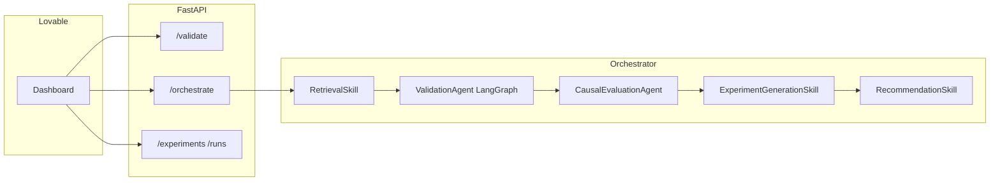

# Architecture tab — copy for [adaptivegaming.lovable.app](https://adaptivegaming.lovable.app)

Use this text (or adapt your UI components) so the **Architecture** tab matches the **Dell-Capstone** API repo as implemented today. Source of truth: `src/api/main.py`, `src/agent/orchestrator.py`, `docs/architecture.md`.

---

## System map

| Layer | What runs | Notes |
|-------|-------------|--------|
| **Client** | Lovable app (`*.lovable.app`) | Calls your Railway `VITE_API_URL` (or equivalent). |
| **API** | FastAPI **v0.1.0** (`mvp-starter`) | CORS allows Lovable hosts by regex when `CORS_ALLOW_ORIGINS` is empty or `*`. |
| **Orchestration** | `AdaptiveExperimentationOrchestrator` | Sequential skills; **not** a single monolithic LLM agent. |
| **Data** | Benchmark parquets under `BENCHMARK_DATA_DIR` | Default: `synthetic_env/benchmarks/generated_sanity_calibrated`. Fallback stub if bundle missing for an id. |
| **History (demo)** | SQLite `RUN_HISTORY_DB` (default `data/demo_orchestrate.sqlite`) | Records success/failure of `POST /orchestrate`; ephemeral on Railway without a volume. |
| **LLM** | Azure OpenAI (optional) | `src/llm/azure_factory.py` — roles: **validation**, **generation**, **stat**. Requires `AZURE_OPENAI_ENDPOINT` + `AZURE_OPENAI_API_KEY`. |
| **Tracing** | LangSmith (optional) | `@traceable` wrappers in `src/agent/traced_steps.py` when `langsmith` is installed and env is set. |

---

## HTTP surface (current)

| Method | Path | Role |
|--------|------|------|
| `GET` | `/` | Service id + `mode: mvp-starter`. |
| `GET` | `/health` | Liveness (`{"status":"ok"}` today — not full data readiness). |
| `POST` | `/validate/{experiment_id}?objective=...` | Retrieval → **LangGraph validation agent** only. |
| `POST` | `/orchestrate/{experiment_id}?objective=...` | Full pipeline (below). Returns `run_record_id` on success. |
| `GET` | `/experiments` | Catalog from `experiments.parquet`. |
| `GET` | `/runs` | Registry rows for Lovable run picker. |
| `GET` | `/runs/{run_id}` | Snapshot for one experiment when parquets exist. |

There is **no** separate `POST /recommend/...` or `POST /analyze/...` in this branch — recommendation is **inside** `/orchestrate` response under `recommendation`.

---

## Canonical pipeline (`POST /orchestrate`)

```text
RetrievalSkill
    → load_benchmark_context(parquets) or fallback stub
ValidationSkill (ValidationAgent / LangGraph)
    structural → metrics → benchmark → world_spec → decide → llm_diagnostics
    → decision: go | caution | stop  (stop → HTTP 500, validation halted)
CausalEvaluationSkill (CausalEvaluationAgent)
    default: programmatic causal + schema validation
    optional: LangGraph ReAct when ENABLE_CAUSAL_AGENT_LOOP=true (+ Azure "stat" deployment)
ExperimentGenerationSkill (optional branch)
    ENABLE_GENERATION_AGENT=false (default): stub RecommendationCandidate rows
    true: GenerationAgent (Azure "generation")
RecommendationSkill
    deterministic score + rank (heuristic; not a LangGraph graph in current code)
```

**Ranking inputs (v1):** `ranking_candidates_from_context` builds one candidate per **metrics** row (arms), not from a separate LangGraph recommendation agent in this snapshot.

**LangSmith:** the span name `recommendation_agent_v1` in traces refers to this **RecommendationSkill** step (naming legacy); there is no separate `RecommendationAgent` Python module in this tree.

---

## Validation graph (LangGraph)

Nodes: **structural** → **metrics** → **benchmark** → **world_spec** → **decide** → **llm_diagnostics**.

- **go / caution / stop** is computed in **decide** from check severities (see `src/agent/validation_agent.py`).
- **llm_diagnostics** is narrative only; `ENABLE_VALIDATION_LLM` + Azure enables Azure-backed summary.

---

## Environment highlights (Railway / Lovable)

- `BENCHMARK_DATA_DIR` — parquet bundle path.
- `AZURE_OPENAI_*` — Foundry / Azure OpenAI endpoint + key.
- `VALIDATION_LLM_MODEL`, `GENERATION_LLM_MODEL`, `STAT_LLM_MODEL` — **deployment names** (defaults e.g. `capstone-mini`, `capstone-standard`, `capstone-code` in settings).
- `ENABLE_VALIDATION_LLM`, `ENABLE_CAUSAL_AGENT_LOOP`, `ENABLE_GENERATION_AGENT` — feature gates.
- `RUN_HISTORY_DB` — SQLite path for orchestrate history.

---

## What to fix on the Lovable Architecture tab

1. **Remove or relabel** any reference to standalone `/recommend` or `/analyze` unless you merge a branch that adds them.
2. **API version**: show **0.1.0** / `mvp-starter` if you display version from `GET /`.
3. **Pipeline order**: retrieval → **validation (LangGraph)** → **causal** (programmatic by default) → **optional generation** → **recommendation (scoring skill)**.
4. **Recommendation**: clarify it is the **RecommendationSkill** (deterministic ranker), not a second LangGraph agent in this codebase.
5. **Telemetry**: LangSmith is optional middleware; SQLite run history is **demo** persistence for orchestrate only.

---

## Optional diagram (Mermaid)

Paste into any Mermaid-capable doc or Lovable markdown block:



---

## Questions for you (if something still looks wrong)

1. Does Lovable point at the **same** Railway deploy that built from this repo branch, or an older service?
2. Is the Architecture tab **hard-coded copy** or driven from `GET /` / env? If you export the Lovable project (or paste the Architecture component source), we can diff it line-by-line.
