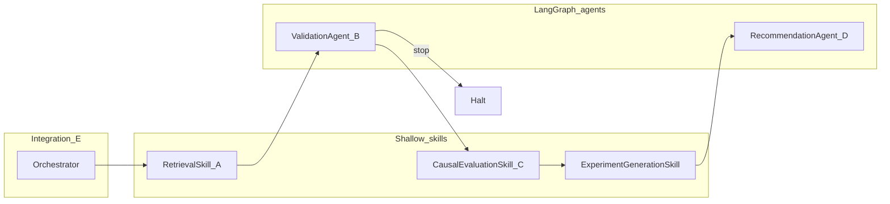

# Workstream agent strategy (A–E)

**Purpose:** Guide development across team workstreams using three lenses:

1. **Cursor subagents** — parallel exploration and CI during implementation (not runtime).
2. **Deep agents** — multi-node LangGraph workflows in the product.
3. **LLM integration** — where models are allowed, optional, or excluded.

**Related:** [`EXPERIMENTATION_DEV_PLAN.md`](EXPERIMENTATION_DEV_PLAN.md) §7, [`architecture.md`](architecture.md) §7–8, [`validation_agent.md`](validation_agent.md), [`recommendation_agent.md`](recommendation_agent.md).

---

## 1. Workstream map (runtime)

| WS | Skill / agent | Runtime style | LLM today |
|----|---------------|---------------|-----------|
| **A** | `RetrievalSkill` | Single class (stub → Parquet/SQL target) | None |
| **B** | `ValidationAgent` | LangGraph (6 nodes) | Optional `llm_diagnostics` only |
| **C** | `CausalEvaluationSkill` | Single class (stub → estimators) | None (by design) |
| **D** | `ExperimentGenerationSkill` + `RecommendationAgent` | Gen stub; rec LangGraph (4 nodes) | Optional `explain` only |
| **E** | `AdaptiveExperimentationOrchestrator` + FastAPI | Linear skill chain | Env flags on `/validate`, `/recommend` |

**E** composes A→B→C→generation→D. It does not use LangGraph at the top level (intentional: explicit, debuggable flow).

---

## 2. Cursor subagents (development only)

Use Cursor **Task** subagents when work is cross-folder, parallelizable, or procedural. Skip them for single-file edits or one known failing test.

| Workstream | Delegate to subagent | Type |
|------------|----------------------|------|
| **A** | Map `synthetic_env/benchmarks/` → `RetrievalSkill` contracts; prototype warehouse reads | `explore`, `shell` |
| **B** | Trace check severity → `decide` → orchestrator `stop`; generate benchmarks + `pytest -m slow` | `explore` ×2, `shell` |
| **C** | Find all `evaluation` consumers before swapping stub for EconML/statsmodels | `explore` |
| **D** | Scoring vs docs; generation schema when adding LLM | `explore` |
| **E** | API vs orchestrator parity; contract tests after glue changes | `explore`, `shell` |
| **A+C** | Parallel design for retrieval + causal eval, parent merges | `generalPurpose` ×2 |
| **Merge** | B + D branch conflicts on `orchestrator.py`, `api/main.py`, `models.py` | `explore` ×2 |

**Regression gate (always run via `shell` subagent or locally):**

```bash
cd Dell-Capstone-KB
PYTHONPATH="src:." pytest tests/test_workstream_be_contracts.py tests/test_smoke.py -q
```

---

## 3. Deep agents (product / LangGraph)

### 3.1 What exists today



| Layer | Deep agent? | Notes |
|-------|-------------|--------|
| **B** | Yes | Deterministic nodes; `llm_diagnostics` runs **after** `decide` |
| **D (recommendation)** | Yes | `prepare → score → rank → explain`; scores are deterministic |
| **A, C, generation** | No | Correct for MVP auditability |
| **E** | No | Calls deep agents via thin skills |

### 3.2 Recommended next deep-agent work

Aligned with [`architecture.md`](architecture.md) (multi-agent, progressive disclosure, ≤10 tools per agent):

| Candidate | Rationale |
|-----------|-----------|
| **RetrievalAgent (A)** | SQL/Parquet + optional embedding search = many tools; split from unstructured doc retrieval |
| **Generation subgraph (D-input)** | LLM proposes arms → **schema validation node** (mirror B’s pattern) |
| **Keep C shallow** | Causal lift must stay reproducible; no LLM in the estimator path |
| **Keep E linear** | Top-level LangGraph adds little; compose existing graphs |

**Pattern:** one agent for heavy/tool work, one node (or agent) for structured output validation.

---

## 4. LLM integration

### 4.1 Wired today

| Module | Env | Affects decisions? |
|--------|-----|-------------------|
| `src/validation/llm_diagnostics.py` | `ENABLE_VALIDATION_LLM` | No — narrative after `go/caution/stop` |
| `src/recommendation/llm_explanation.py` | `ENABLE_RECOMMENDATION_LLM` | No — explains top pick after scoring |
| LangSmith | `LANGCHAIN_TRACING_V2`, `LANGCHAIN_API_KEY` | Observability only |
| `synthetic_env/world_spec/llm_helpers.py` | — | Prompt scaffolds only (not in pipeline) |

Install: `pip install -e ".[llm]"`. See `.env.example`.

### 4.2 Principles

From [`architecture.md`](architecture.md) §8:

- **Good:** summarization, structured hypothesis generation, rationale, constrained SQL drafting.
- **Bad:** statistical tests, validation logic, silent production rollouts.

**LLM = proposal and orchestration layer; evaluation and validation stay deterministic.**

### 4.3 Roadmap by workstream

| WS | Next step | Guardrail |
|----|-----------|-----------|
| **A** | Optional NL→SQL or memory embedding search | Validate against `Experiment` / `Observation` schemas |
| **B** | Keep LLM post-`decide` only | Never change `decision` from model output |
| **C** | Real estimators (statsmodels / EconML); no LLM in lift path | Optional separate “analyst narrative” field only |
| **D gen** | LangGraph: `propose → validate_schema → emit` | Schema failures → warnings/errors like B |
| **D rec** | Keep `explain` optional | `lift_aware_v1` always drives rank |
| **E** | Pass `BENCHMARK_DATA_DIR` + LLM flags through orchestrator (parity with `/validate`) | Single config surface |

### 4.4 Known integration gap (E)

`POST /orchestrate` does not yet inject `_validation_runtime_options()` (benchmark dir, validation LLM) into the orchestrator path, while `POST /validate` does. Fix in E when hardening integration.

---

## 5. Quick reference: which lever when?

| Goal | Use |
|------|-----|
| Implement Parquet/SQL retrieval | Product work on **A**; Cursor `explore` on benchmarks |
| Add causal estimator | **C** skill + tests; Cursor `explore` for consumers |
| Stakeholder narrative on validation | **B** LLM (`ENABLE_VALIDATION_LLM`) |
| Propose new arms safely | **D** generation deep agent + schema node |
| Rank and explain next test | **D** `RecommendationAgent` (exists) |
| Full pipeline smoke | **E** + `test_workstream_be_contracts.py` |
| PR merge safety | Cursor `explore` on orchestrator/API conflicts |

---

## 6. Document control

| Version | Notes |
| ------- | ----- |
| 1.0 | Initial strategy doc (subagents, deep agents, LLM across A–E) |
