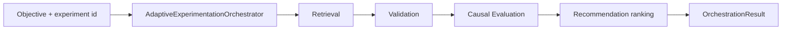
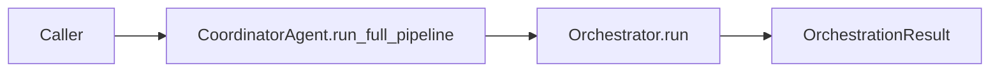

# Agent system map (v1)

Recommendation-first adaptive experimentation on a **thin canonical path**: retrieval → validation → causal evaluation → recommendation. Skill boundaries remain LangSmith-visible via `TraceNames` in [`src/observability/langsmith_trace.py`](../src/observability/langsmith_trace.py). **Team-facing implementation plan**: [`implementation_plan_v1.md`](implementation_plan_v1.md).

Public reference dataset (evaluation / examples):

- [LangSmith public dataset — Capstone Adaptive Exp Agent](https://smith.langchain.com/public/5932f940-296c-4e7a-b8fc-662111b8baa3/d)

---

## Coordinator vs orchestrator (role split)

| Component | Role |
|-----------|------|
| **`AdaptiveExperimentationOrchestrator`** (`src/agent/orchestrator.py`) | **Canonical pipeline owner (v1)**: retrieval → validation → causal evaluation → recommendation; constructs **`OrchestrationResult`**. Experiment **generation is not invoked** here (Phase 2 / Slice D). |
| **`CoordinatorAgent`** (`src/agent/coordinator.py`) | **Entry + umbrella traces**: `run_full_pipeline` delegates to the orchestrator. `run_minimal_demo_flow` is **smoke-only** — not benchmarked against the canonical path. |

Services can call the orchestrator directly (e.g. FastAPI) or the coordinator when an explicit **`coordinator_run`** parent span is desired.

---

## Two execution paths (must not be conflated)

| Path | Entry | Runs | Benchmark v1 relevance |
|------|--------|------|-------------------------|
| **Canonical v1** | `AdaptiveExperimentationOrchestrator.run` or `CoordinatorAgent.run_full_pipeline` | retrieval → validation → causal evaluation → recommendation | **Yes** — this is the path slices A–F implement against the frozen baseline |
| **Smoke / minimal** | `CoordinatorAgent.run_minimal_demo_flow` | retrieval → validation → recommendation (stub eval/candidates; **skips causal**) | **No** — LangSmith onboarding / sanity only |

Canonical LangSmith child spans (`coordinator_run` umbrella when using coordinator): `retrieval_skill`, `validation_skill`, `causal_evaluation_skill`, `recommendation_agent_v1`.

Smoke umbrella: **`coordinator_minimal_demo`** — fires only **`retrieval_skill`**, **`validation_skill`**, **`recommendation_agent_v1`** (no **`causal_evaluation_skill`**).

**`experiment_generation_skill`**: retained for Slice D; **does not execute** on the canonical path in v1 (no span emitted there).

---

## High-level flow — canonical v1 (synchronous)

Proposal layer (**experiment generation**) branches here in **Phase 2** only (`docs/implementation_plan_v1.md`).

Optional coordinator umbrella:

Sequential, synchronous, single process — no RL, no swarm orchestration.

---

## OrchestrationResult (contract)

On success (validation not `stop`):

- **`experiment`**, **`memory`**, **`metrics`** — retrieval context
- **`validation_report`** — quality gate
- **`evaluation`** — causal / stats layer artifact
- **`candidates`** — **v1:** ranking envelope built from retrieval (`src/agent/ranking_inputs.py`). **Phase 2:** may include proposal-layer outputs; same schema contract.
- **`recommendation`** — ranked next actions bundle

Validation **`stop`** still raises — no partial `OrchestrationResult` in v1.

---

## LangSmith placement

`src/agent/traced_steps.py` for skill decorators; **`CoordinatorAgent`** for umbrellas. Naming: [`langsmith_trace_plan.md`](langsmith_trace_plan.md).

---

## Persistence (recap)

| Phase | Persistence |
|-------|-------------|
| **v1** | Benchmark Parquet/files; Postgres optional later |
| **v1.1+** | Optional Postgres for memory / retrieval at scale |

UI (CopilotKit, etc.) is **out of v1**.

---

## LLM provider (early protos later)

Defer until Slice D/E require real calls; stubs remain deterministic until then. See [`implementation_plan_v1.md`](implementation_plan_v1.md) out-of-scope section.
