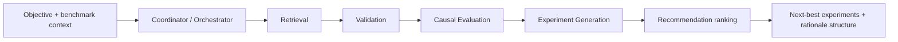

# Agent system map (v1)

Recommendation-first adaptive experimentation: a **coordinator** routes an objective through five **skills**, then aggregates a ranked recommendation. Each skill invocation is exposed as its own LangSmith-run name for dashboards and regression checks.

Public reference dataset (evaluation / examples):

- [LangSmith public dataset — Capstone Adaptive Exp Agent](https://smith.langchain.com/public/5932f940-296c-4e7a-b8fc-662111b8baa3/d)

---

## Roles

| Component | Responsibility |
|-----------|----------------|
| **CoordinatorAgent** (`src/agent/coordinator.py`) | Entry point: accepts objective + experiment id; groups a full pipeline or minimal demo trace. |
| **AdaptiveExperimentationOrchestrator** (`src/agent/orchestrator.py`) | Full synchronous pipeline wiring (skills in order). |
| **Skills** (`src/skills/*.py`) | Retrieval, validation, causal evaluation stub, experiment generation stub, recommendation stub. |

---

## High-level flow (synchronous pipeline)

**Default orchestration**: sequential, synchronous, single process. Async / distributed orchestration is out of scope for v1.

---

## LangSmith placement

Runs are segmented at skill boundaries (`src/agent/traced_steps.py`) and coordinator-level wrappers (`CoordinatorAgent`). See [`docs/langsmith_trace_plan.md`](langsmith_trace_plan.md) for run names.

---

## Persistence (team decision recap)

| Phase | Persistence |
|-------|-------------|
| **v1** | Parquet / structured files (synthetic benchmark + local artifacts); no mandatory Postgres for agent runs. |
| **v1.1+** | Optional Postgres for experiment memory and retrieval-heavy workloads. |

UI (e.g. CopilotKit) is **phase 2** — not required for traced agent demos.

---

## LLM provider (single choice for early protos)

Pick **one** provider for LangChain / LangGraph v1 scaffolding so traces and tooling stay consistent:

| Option | Typical use |
|--------|--------------|
| **OpenAI** (default recommendation) | Fast LangChain ergonomics for structured JSON and graph nodes |
| **Anthropic** | Strong alternative when the team prefers Claude for reasoning-heavy generation |

Defer multi-provider routing until after retrieval + benchmarks are wired.
