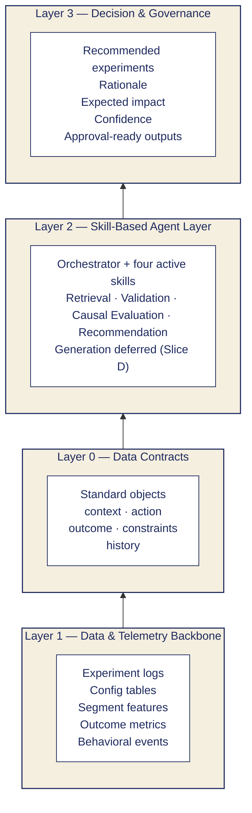
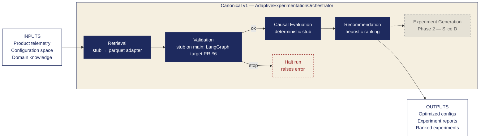
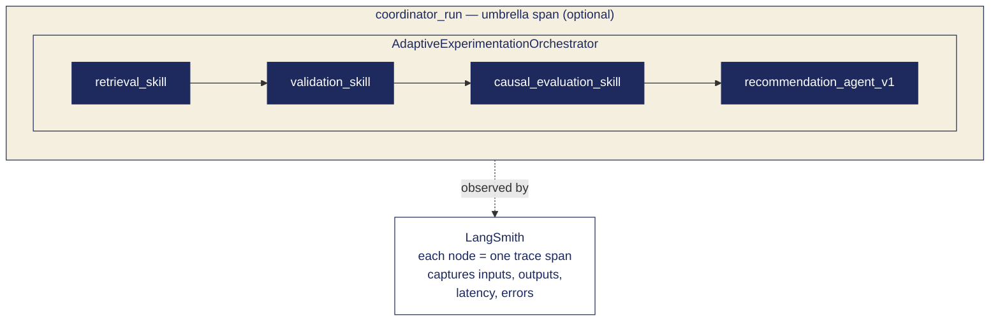

# Architecture Diagrams — Adaptive Experimentation Agent

Visual reference for the system architecture (**Workstream E — documentation / diagrams**).
These diagrams use [Mermaid](https://mermaid.js.org/) and render automatically on GitHub.

> **Naming:** **Workstream E** = this diagram deliverable. **Slice E** in
> [`implementation_plan_v1.md`](implementation_plan_v1.md) = Quality Gate (validation implementation).

**Sources:** [`docs/architecture.md`](architecture.md), [`docs/agent_architecture.md`](agent_architecture.md),
[`docs/skills_catalog.md`](skills_catalog.md), [`docs/implementation_plan_v1.md`](implementation_plan_v1.md).
Validation deep-dive (when merged): `docs/validation_agent.md` (see PR #6).

---

## 1. System overview — the four layers

**Question answered:** *How is the system structured?*

Raw data enters at the bottom and flows upward, becoming standardized, then
processed by the agent skills, and finally turned into governed decisions.

> **Why Layer 0 sits between Layer 1 and Layer 2:** the data contracts are the
> *standardization boundary*. Anything below is raw or domain-specific; anything
> above operates on a fixed object schema. This is what lets skills be swapped
> without breaking the rest of the system.

---

## 2. Canonical v1 flow — the main diagram

**Question answered:** *How does a single run execute?*

The orchestrator runs **four skills** in sequence on `main`. **Experiment Generation**
exists in the codebase but is **not wired** into the canonical v1 path (Slice D / Phase 2).

> **Note on validation:** if Validation returns `stop`, the orchestrator **raises**
> (`ValueError` on `main`) before Causal Evaluation and Recommendation run — no
> partial `OrchestrationResult` in v1.
>
> **Slice labels** (see `docs/implementation_plan_v1.md`):
> Retrieval (Slice A), Validation (Slice E — hardens), Causal Evaluation (Slice B),
> Recommendation (Slice C), Experiment Generation (Slice D — deferred).

---

## 3. Observability — LangSmith tracing

**Question answered:** *How do we see what the agent is doing?*

Each canonical step emits a named trace span. Use **`CoordinatorAgent.run_full_pipeline`**
for a **`coordinator_run`** umbrella span (optional; direct orchestrator calls omit it).

> **`experiment_generation_skill`** does not appear on canonical v1 runs until Slice D
> is wired into orchestration.

---

## Appendix — Data Contracts at a glance

A quick reference for the standard objects that move between skills (Layer 0).

| Object        | Purpose                                              |
|---------------|------------------------------------------------------|
| `context`     | Who / where / when the decision is being made for    |
| `action`      | The candidate experiment or configuration change     |
| `outcome`     | Observed or predicted result of an action            |
| `constraints` | Hard limits the recommendation must respect          |
| `history`     | Prior experiments and their outcomes                 |

These objects are the *only* thing that crosses skill boundaries, which is what
keeps the system modular.

---
