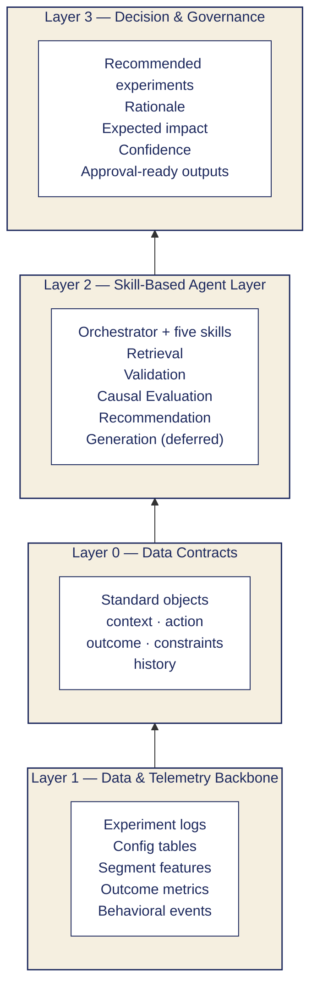
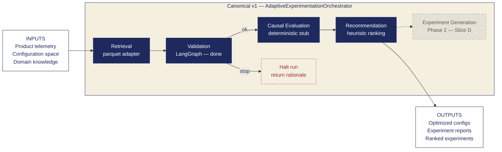
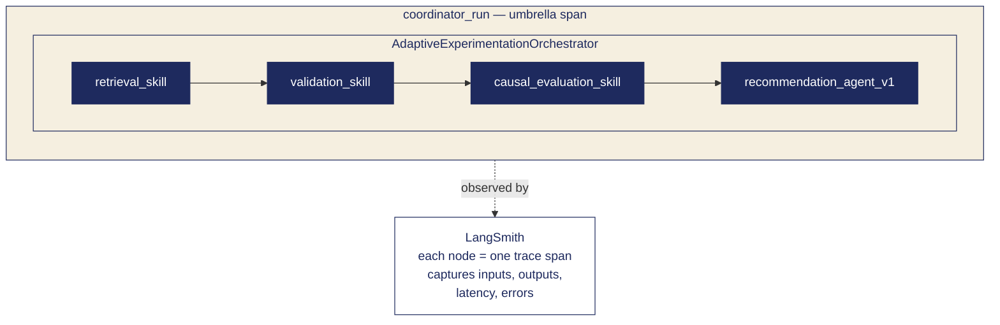

# Architecture Diagrams — Adaptive Experimentation Agent

Visual reference for the system architecture (**Workstream E**). These diagrams
use [Mermaid](https://mermaid.js.org/) and render automatically on GitHub.

**Sources:** `docs/architecture.md`, `docs/skills_catalog.md`,
`docs/validation_agent.md`.

---

## 1. System overview — the four layers

**Question answered:** *How is the system structured?*

Raw data enters at the bottom and flows upward, becoming standardized, then
processed by the agent skills, and finally turned into governed decisions.

> **Why Layer 0 sits between Layer 1 and Layer 2:** the data contracts are the
> *standardization boundary*. Anything below is raw or domain-specific; anything
> above operates on a fixed object schema. This is what lets skills be swapped
> without breaking the rest of the system.

---

## 2. Canonical v1 flow — the main diagram

**Question answered:** *How does a single run execute?*

The orchestrator runs four skills in sequence. **Experiment Generation** exists
in the code but is **deferred** — it is not wired into the v1 path yet.

> **Note on validation:** if the Validation step returns `stop`, the
> orchestrator halts before Causal Evaluation and Recommendation run, and
> emits a rationale instead of a recommendation.
>
> **Slice labels** mirror `docs/skills_catalog.md`:
> Retrieval (Slice A — parquet adapter), Validation (Slice E hardens — already
> done in v1), Causal Evaluation (Slice B deepens — currently a deterministic
> stub), Recommendation (Slice C replaces — currently heuristic), and
> Experiment Generation (Slice D — Phase 2, not wired in).

---

## 3. Observability — LangSmith tracing

**Question answered:** *How do we see what the agent is doing?*

Every step emits a named trace span. The whole run is wrapped in a
`coordinator_run` umbrella span so the team can debug any single execution end
to end.

> **Why this matters:** because each span captures inputs, outputs, latency and
> errors, any failed run can be replayed and inspected without re-running the
> pipeline. This is what makes the agent trustworthy to Nicholas and the rest
> of the team.

---

## Appendix — Data Contracts at a glance

A quick reference for the standard objects that move between skills (Layer 0).

| Object        | Purpose                                              |
|---------------|------------------------------------------------------|
| `context`     | Who / where / when the decision is being made for    |
| `action`      | The candidate experiment or configuration change     |
| `outcome`     | Observed or predicted result of an action            |
| `constraints` | Hard limits the recommendation must respect          |
| `history`     | Prior experiments and their outcomes                 |

These objects are the *only* thing that crosses skill boundaries, which is what
keeps the system modular.

---
