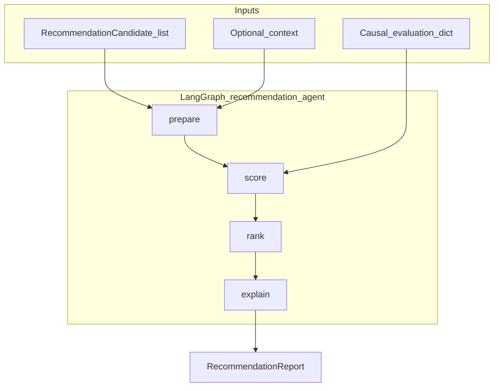

# Recommendation agent (Workstream D)

This document explains the **Recommendation logic** agent: how it ranks next-best experiments, how it mirrors the validation agent pattern, and how to run it.

**Branch:** `experimentation/recommendation-agent`  
**Primary code:** `src/agent/recommendation_agent.py`, `src/recommendation/`, `src/skills/recommendation.py`

---

## 1. Purpose

After validation and causal evaluation, and once candidate experiments exist, recommendation answers:

> **Which next test should we run first, and why?**

This implements **Skill 5 — Recommendation / Policy Selection** from [`docs/architecture.md`](architecture.md). The MVP is **scoring-based ranking** (not autonomous traffic allocation). Humans still approve launches.

---

## 2. High-level architecture

The agent combines:

| Layer | Role |
|-------|------|
| **Deterministic scoring** | Lift-aware formula using per-candidate `metric_stub` + evaluation uncertainty |
| **Ranking** | Sort by score, assign `rank` |
| **Explanation** | Template summary or optional LLM narrative for stakeholders |



---

## 3. Repository layout

| Path | Role |
|------|------|
| `src/agent/recommendation_agent.py` | LangGraph workflow + `RecommendationAgent` |
| `src/skills/recommendation.py` | Thin wrapper for orchestrator |
| `src/recommendation/scoring.py` | Per-candidate score + `score_components` breakdown |
| `src/recommendation/ranking.py` | Sort and `rank` assignment |
| `src/recommendation/input_checks.py` | Pre-flight warnings (single candidate, missing metrics) |
| `src/recommendation/llm_explanation.py` | Template or optional OpenAI explanation |
| `src/data/models.py` | `RecommendationCandidate`, `RecommendationReport` |
| `src/skills/experiment_generation.py` | Produces multiple candidates for ranking |
| `tests/test_recommendation_agent.py` | Unit tests |

**Related workstreams**

| Workstream | Upstream of recommendation |
|------------|----------------------------|
| B — Validation | Gates bad data (`stop` halts orchestrator) |
| C — Causal evaluation | Supplies `uncertainty`, `estimated_lift`, directions |
| Generation | Builds `RecommendationCandidate` list |

---

## 4. LangGraph nodes

1. **`prepare`** — `run_input_checks(candidates, evaluation)` → `warnings[]`
2. **`score`** — `score_candidate` for each row → `scored_candidates[]`
3. **`rank`** — `rank_scored_candidates` → `ranked_candidates[]`, `top_recommendation`
4. **`explain`** — template or LLM → `explanation`, `explanation_source`

---

## 5. Scoring formula (`lift_aware_v1`)

This is a **lift-aware ranker**, not UCB/explore-exploit (future Phase B optimization).

```
score = retention
        - λ * sqrt(variance)
        + w_u * (1 - uncertainty)
        + min(estimated_lift, 0.25)
```

| Symbol | Source | Default |
|--------|--------|---------|
| `retention` | `candidate.metric_stub.retention` | `0` if missing |
| `variance` | `candidate.metric_stub.variance` | `0` if missing |
| `uncertainty` | `evaluation.uncertainty` | `0.1` |
| `estimated_lift` | `evaluation.estimated_lift` or `placeholder_lift` | `0` |
| `λ` | `RECOMMENDATION_VARIANCE_LAMBDA` | `0.2` |
| `w_u` | `RECOMMENDATION_UNCERTAINTY_WEIGHT` | `0.2` |

Each scored row includes `score_components` for explainability and audit.

**Design note:** `(1 - uncertainty)` rewards **lower** uncertainty in v1. A future UCB-style ranker would likely **reward** uncertainty for exploration; that would be a separate `ranking_method`.

---

## 6. Input / output contracts

### Input

```python
RecommendationAgent().run(
    candidates: list[RecommendationCandidate],
    evaluation: dict,  # from CausalEvaluationSkill
    context: dict | None = None,  # optional retrieval context
)
```

`RecommendationCandidate` fields (see `src/data/models.py`):

- `candidate_name`, `parameter_changes`, `rationale`, `expected_tradeoff`
- `target_segment`, `implementation_notes`, `signal_from_eval`
- `metric_stub`: `{"retention": float, "variance": float}`

### Output (`RecommendationReport`)

```json
{
  "schema_version": "v1.0",
  "ranking_method": "lift_aware_v1",
  "top_recommendation": {
    "candidate_name": "exp_001-candidate-2",
    "score": 0.512,
    "rank": 1,
    "score_components": {
      "retention": 0.48,
      "variance_penalty": 0.028,
      "uncertainty_bonus": 0.18,
      "lift_bonus": 0.0065
    },
    "rationale": "..."
  },
  "ranked_candidates": [ "..."] ,
  "explanation": "Recommended next test: ...",
  "explanation_source": "template",
  "warnings": ["Only one candidate supplied; ranking is degenerate."]
}
```

Backward-compatible fields for existing clients: `top_recommendation`, `ranked_candidates`.

---

## 7. Configuration

| Variable | Default | Purpose |
|----------|---------|---------|
| `ENABLE_RECOMMENDATION_LLM` | `false` | LLM explanation for top pick |
| `RECOMMENDATION_LLM_MODEL` | `gpt-4o-mini` | Model when LLM enabled |
| `RECOMMENDATION_VARIANCE_LAMBDA` | `0.2` | Variance penalty weight λ |
| `RECOMMENDATION_UNCERTAINTY_WEIGHT` | `0.2` | Uncertainty bonus weight w_u |
| `LANGCHAIN_API_KEY` | — | Used when LLM enabled / LangSmith |

```bash
pip install -e ".[llm]"
```

---

## 8. How to run

### 8.1 Python

```python
from src.agent.recommendation_agent import RecommendationAgent
from src.skills.causal_evaluation import CausalEvaluationSkill
from src.skills.experiment_generation import ExperimentGenerationSkill
from src.skills.retrieval import RetrievalSkill

context = RetrievalSkill().run(objective="day7_retention", experiment_id="exp_001")
evaluation = CausalEvaluationSkill().run(context)
candidates = ExperimentGenerationSkill().run(context=context, evaluation=evaluation)

report = RecommendationAgent().run(candidates=candidates, evaluation=evaluation, context=context)
print(report["top_recommendation"]["candidate_name"], report["explanation"])
```

### 8.2 Full orchestrator

```python
from src.agent.orchestrator import AdaptiveExperimentationOrchestrator

result = AdaptiveExperimentationOrchestrator().run(
    objective="improve_retention",
    experiment_id="exp_001",
)
print(result.recommendation)
```

### 8.3 HTTP API

```bash
uvicorn src.api.main:app --reload
```

| Endpoint | Description |
|----------|-------------|
| `POST /recommend/{experiment_id}?objective=day7_retention` | Retrieval → evaluation → generation → **recommendation only** |
| `POST /orchestrate/{experiment_id}?objective=...` | Full pipeline including `validation_report` + `recommendation` |

### 8.4 Tests

```bash
pytest tests/test_recommendation_agent.py tests/test_skill_contracts.py -q
```

---

## 9. Observability (LangSmith)

Set the same tracing env vars as validation. Graph nodes (`prepare`, `score`, `rank`, `explain`) appear as spans when `LANGCHAIN_TRACING_V2=true`.

---

## 10. Extending recommendation

| Goal | Where to change |
|------|-----------------|
| New scoring signal | `src/recommendation/scoring.py` + document in this file |
| UCB / bandit ranker | New `ranking_method`; add node or branch in `recommendation_agent.py` |
| More candidates | `ExperimentGenerationSkill` or Slice A retrieval |
| Stricter input gates | `input_checks.py` (warnings today; errors if you add halt logic) |
| Custom LLM prompt | `llm_explanation.py` |

---

## 11. Comparison to validation agent (Workstream B)

| Aspect | Validation (B) | Recommendation (D) |
|--------|----------------|----------------------|
| Graph nodes | structural → metrics → benchmark → world_spec → decide → llm | prepare → score → rank → explain |
| Primary output | `go` / `caution` / `stop` | Ranked list + top pick |
| LLM role | Diagnostics on data quality | Narrative for top experiment |
| Blocks pipeline? | Yes on `stop` | No — always returns a report (may be empty) |

---

## 12. FAQ

**Why does candidate-2 often win in the stub pipeline?**  
Generation assigns it a higher `metric_stub.retention` (+0.08 vs baseline) for demo ranking.

**Same score for all candidates?**  
Usually missing or identical `metric_stub.retention` — see warnings in the report.

**Difference from `src/evaluation/scoring.py`?**  
`weighted_score` is a generic helper; recommendation scoring lives in `src/recommendation/scoring.py` with experiment-specific semantics.

**When to use `/recommend` vs `/orchestrate`?**  
Use `/recommend` to iterate on ranking only; `/orchestrate` for end-to-end including validation gate.
