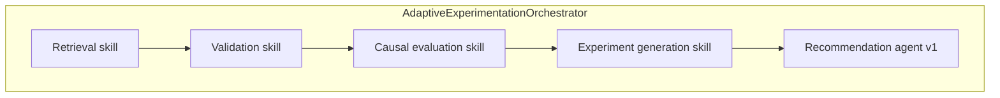

# Skills catalog (Claude Harness–style summaries)

Trace names refer to LangSmith span names (`src/observability/langsmith_trace.py`).

---

## Where skills run: full pipeline vs smoke

| | **Canonical full pipeline** | **Smoke minimal** (`CoordinatorAgent.run_minimal_demo_flow`) |
|--|----------------------------|---------------------------------------------------------------|
| **Owner** | `AdaptiveExperimentationOrchestrator.run` | Coordinator only (does not call orchestrator `run`) |
| **Skills invoked** | All five below | Retrieval, validation, recommendation only (stub eval + candidates) |

The **orchestrator** is the single source of truth for the full five-step wiring. The **coordinator** adds umbrella traces and the optional smoke shortcut.

---

## 1. Retrieval (`retrieval_skill`)

| Item | Detail |
|------|--------|
| **Purpose** | Gather relevant experiment history and context buckets for downstream validation and evaluation |
| **Input** | `objective`, `experiment_id`; later: filters, segment, DB / parquet paths |
| **Logic / tools** | Today: deterministic stub tables; roadmap: parquet / SQL loaders |
| **Output** | `dict` with `experiment`, `arms`, `memory`, `metrics` |
| **LangSmith** | `retrieval_skill` |
| **Full pipeline** | Yes |
| **Smoke** | Yes |

---

## 2. Validation (`validation_skill`)

| Item | Detail |
|------|--------|
| **Purpose** | Block unusable experiments (traffic split missing, metrics empty, …) |
| **Input** | Retrieval context bundle |
| **Logic** | Rules + flags (`go` / `caution` / `stop`) |
| **Output** | `validation_report` dict |
| **LangSmith** | `validation_skill` |
| **Full pipeline** | Yes; on `stop`, orchestrator raises |
| **Smoke** | Yes |

---

## 3. Causal evaluation (`causal_evaluation_skill`)

| Item | Detail |
|------|--------|
| **Purpose** | Auditable uplift / heterogeneity scaffolding (statistics-first, LLM-last) |
| **Input** | Retrieval context bundle |
| **Logic** | Deterministic stubs today; roadmap: statsmodels / sklearn summaries |
| **Output** | `evaluation` dict (lift, uncertainty, hints) — part of `OrchestrationResult` |
| **LangSmith** | `causal_evaluation_skill` |
| **Full pipeline** | Yes |
| **Smoke** | **No** |

---

## 4. Experiment generation (`experiment_generation_skill`)

| Item | Detail |
|------|--------|
| **Purpose** | Propose structured next experiments (constraints-aware) |
| **Input** | Context + causal evaluation artifact |
| **Logic** | Deterministic stubs; roadmap: LLM with strict JSON schema |
| **Output** | `candidates` list — part of `OrchestrationResult` |
| **LangSmith** | `experiment_generation_skill` |
| **Full pipeline** | Yes |
| **Smoke** | **No** |

---

## 5. Recommendation ranking (`recommendation_agent_v1`)

| Item | Detail |
|------|--------|
| **Purpose** | Score order and surface top-next actions with explicit dimensions |
| **Input** | Candidates + evaluation |
| **Logic** | Rule / score blend (stub today) |
| **Output** | `top_recommendation`, `ranked_candidates` — part of `OrchestrationResult` |
| **LangSmith** | `recommendation_agent_v1` |
| **Full pipeline** | Yes |
| **Smoke** | Yes (dummy inputs) |

---

## Coordinator umbrella spans (unchanged names)

| Name | Wraps |
|------|--------|
| `coordinator_run` | Delegation to `AdaptiveExperimentationOrchestrator.run` (full five skills) |
| `coordinator_minimal_demo` | Smoke path only (three skill spans) |

---

## Canonical five-skill graph (full pipeline)

