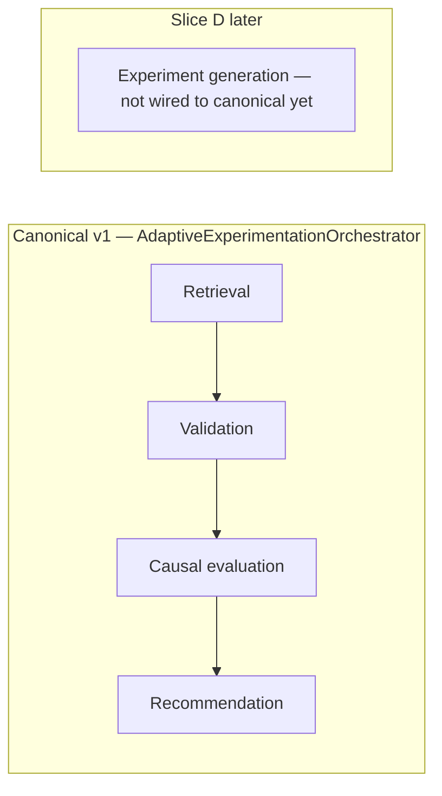

# Skills catalog (Harness-style)

Trace names live in [`src/observability/langsmith_trace.py`](../src/observability/langsmith_trace.py). **Implementation slicing:** [`implementation_plan_v1.md`](implementation_plan_v1.md).

---

## Where skills run: canonical v1 vs smoke

| | **Canonical v1** (`AdaptiveExperimentationOrchestrator.run`) | **Smoke** (`CoordinatorAgent.run_minimal_demo_flow`) |
|--|------------------------------------------------------------|------------------------------------------------------|
| **Purpose** | Benchmarked deterministic path | Tracing onboarding only |
| **Steps** | retrieval → validation → causal evaluation → recommendation | retrieval → validation → recommendation (stub eval/candidates); **causal omitted** |

The orchestrator owns **canonical v1**. The coordinator adds umbrella spans (`coordinator_run` / `coordinator_minimal_demo`).

---

## 1. Retrieval (`retrieval_skill`)

| Field | Detail |
|------|--------|
| **Purpose** | Load / assemble benchmark + experiment context behind one retrieval bundle |
| **Input** | `objective`, `experiment_id`; future: repo paths / filters |
| **Output** | `dict`: `experiment`, `arms`, `memory`, `metrics` |
| **LangSmith** | `retrieval_skill` |
| **Canonical v1** | Yes |
| **Smoke** | Yes |
| **Status** | Stub in-memory shapes; Slice A replaces with parquet adapter |

---

## 2. Validation (`validation_skill`)

| Field | Detail |
|------|--------|
| **Purpose** | Structural / quality gate (world_spec alignment in Slice E) |
| **Input** | Retrieval context bundle |
| **Output** | `validation_report` (`decision`, `issues`) |
| **LangSmith** | `validation_skill` |
| **Canonical v1** | Yes |
| **Smoke** | Yes |
| **Status** | LangGraph validation agent on branch (benchmark + world_spec checks); see `docs/validation_agent.md` |

---

## 3. Causal evaluation (`causal_evaluation_skill`)

| Field | Detail |
|------|--------|
| **Purpose** | Auditable effects / uncertainty summaries |
| **Input** | Retrieval context bundle |
| **Output** | `evaluation` dict (lift, uncertainty, hints) |
| **LangSmith** | `causal_evaluation_skill` |
| **Canonical v1** | Yes |
| **Smoke** | No |
| **Status** | Deterministic stub; Slice B deepens |

---

## 4. Recommendation ranking (`recommendation_agent_v1`)

| Field | Detail |
|------|--------|
| **Purpose** | Score / rank **next-best actions from evidence** |
| **Input** | Ranking envelope (`candidates` list + `evaluation`) |
| **Output** | `top_recommendation`, `ranked_candidates` |
| **LangSmith** | `recommendation_agent_v1` |
| **Canonical v1** | Yes (inputs from retrieval-derived envelope in v1) |
| **Smoke** | Yes (dummy inputs) |
| **Status** | Heuristic stub; Slice C replaces policy |

---

## 5. Experiment generation (`experiment_generation_skill`) — **Phase 2 / Slice D**

| Field | Detail |
|------|--------|
| **Purpose** | Schema-constrained new experiment proposals |
| **Input** | Context + evaluation |
| **Output** | Structured `candidates` (must align with eventual recommendation input contract) |
| **LangSmith** | `experiment_generation_skill` — **not emitted on canonical v1 runs** |
| **Canonical v1** | **Deferred** (`ExperimentGenerationSkill` exists; orchestrator does not call it) |
| **Smoke** | No |
| **Status** | Module stub only; awaits Slice D + contract sign-off |

---

## Coordinator umbrellas

| Name | Wraps |
|------|--------|
| `coordinator_run` | Orchestrator canonical v1 (four skill traces + umbrella) |
| `coordinator_minimal_demo` | Smoke path |

---

