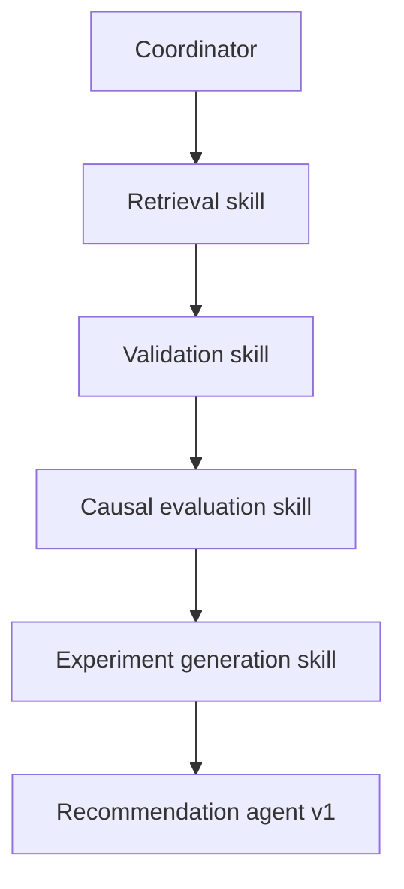

# Skills catalog (Claude Harness–style summaries)

Trace names refer to LangSmith span names (`src/observability/langsmith_trace.py`).

---

## 1. Retrieval (`retrieval_skill`)

| Item | Detail |
|------|--------|
| **Purpose** | Gather relevant experiment history and context buckets for downstream validation and evaluation |
| **Input** | `objective`, `experiment_id`; later: filters, segment, DB / parquet paths |
| **Logic / tools** | Today: deterministic stub tables; roadmap: parquet / SQL loaders |
| **Output** | `dict` with `experiment`, `arms`, `memory`, `metrics` |
| **LangSmith** | `retrieval_skill` |

---

## 2. Validation (`validation_skill`)

| Item | Detail |
|------|--------|
| **Purpose** | Block unusable experiments (traffic split missing, metrics empty, …) |
| **Input** | Retrieval context bundle |
| **Logic** | Rules + flags (`go` / `caution` / `stop`) |
| **Output** | `validation_report` dict |
| **LangSmith** | `validation_skill` |

---

## 3. Causal evaluation (`causal_evaluation_skill`)

| Item | Detail |
|------|--------|
| **Purpose** | Auditable uplift / heterogeneity scaffolding (statistics-first, LLM-last) |
| **Input** | Retrieval context bundle |
| **Logic** | Deterministic stubs today; roadmap: statsmodels / sklearn summaries |
| **Output** | `evaluation` dict (lift, uncertainty, hints) |
| **LangSmith** | `causal_evaluation_skill` |

---

## 4. Experiment generation (`experiment_generation_skill`)

| Item | Detail |
|------|--------|
| **Purpose** | Propose structured next experiments (constraints-aware) |
| **Input** | Context + causal evaluation artifact |
| **Logic** | Deterministic stubs; roadmap: LLM with strict JSON schema |
| **Output** | `list[candidate]` |
| **LangSmith** | `experiment_generation_skill` |

---

## 5. Recommendation ranking (`recommendation_agent_v1`)

| Item | Detail |
|------|--------|
| **Purpose** | Score order and surface top-next actions with explicit dimensions |
| **Input** | Candidates + evaluation |
| **Logic** | Rule / score blend (stub today) |
| **Output** | `top_recommendation`, `ranked_candidates` |
| **LangSmith** | `recommendation_agent_v1` |

---

## Coordinator spans

| Name | Meaning |
|------|---------|
| `coordinator_run` | Ends after full orchestrator wiring |
| `coordinator_minimal_demo` | Short path for onboarding / LangSmith sanity |

---

