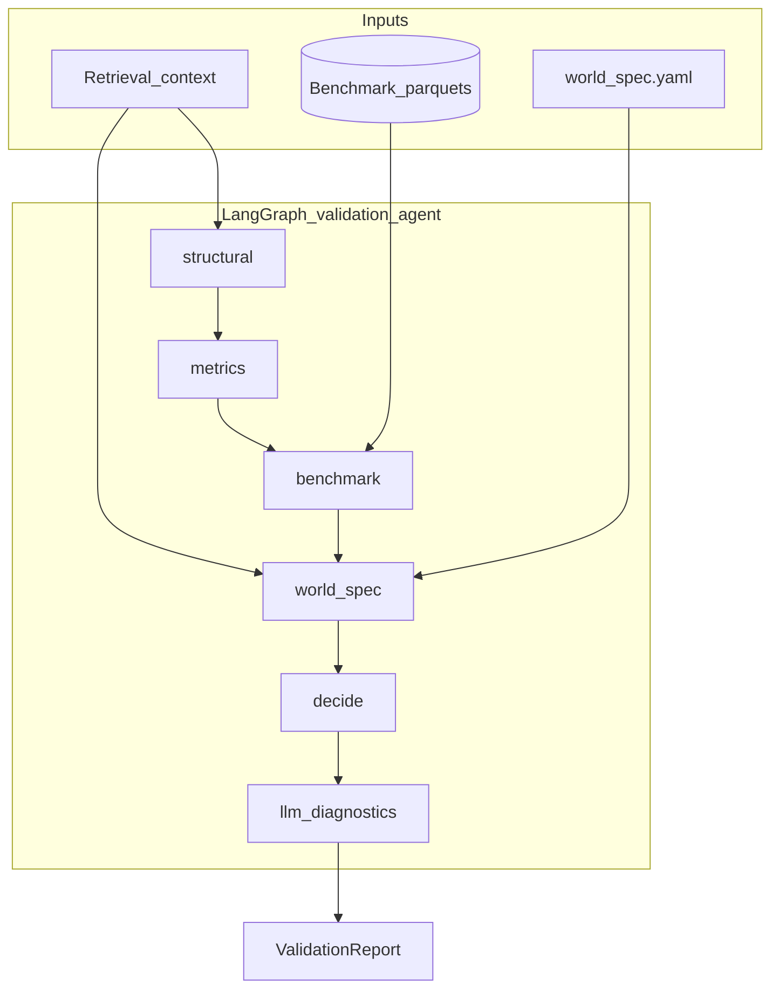

# Validation agent (Workstream B)

This document explains the **Validation & quality checks** agent: what it does, how it fits the repo, how to run it, and where to read the code.

**Branch:** `experimentation/validation-agent`  
**Primary code:** `src/agent/validation_agent.py`, `src/validation/`, `src/skills/validation.py`

---

## 1. Purpose

Before the system evaluates experiments or recommends next tests, validation answers:

> Is the input data **coherent, complete, and realistic enough** to trust downstream skills?

The agent implements **Skill 2 — Validation & Diagnostics** from [`docs/architecture.md`](architecture.md). It is **recommendation-first**: a `stop` decision halts the orchestrator; `caution` allows the pipeline to continue but flags risk for humans.

---

## 2. High-level architecture

Validation uses **two complementary data paths**:

| Path | Source | What it checks |
|------|--------|----------------|
| **Context** | `RetrievalSkill` output (`experiment`, `arms`, `metrics`, `memory`) | Traffic split, arm integrity, metric coverage, sample floors |
| **Benchmark parquets** | Files under `BENCHMARK_DATA_DIR` | Structural / statistical / behavioral / decision-usefulness (reuses `synthetic_env/validation/checks.py`) |

A third layer applies **`configs/world_spec.yaml` constraints** as **warnings only** (they do not alone trigger `stop`).

An optional **LLM diagnostics** step turns the report into a short narrative for stakeholders (with a deterministic template fallback).



---

## 3. Repository layout

| Path | Role |
|------|------|
| `src/agent/validation_agent.py` | LangGraph workflow + `ValidationAgent` entry point |
| `src/skills/validation.py` | Thin skill wrapper used by the orchestrator |
| `src/validation/checks.py` | Context-based rules (traffic, arms, metrics) |
| `src/validation/benchmark_loader.py` | Loads `population`, `experiments`, `arms`, `observations`, `metrics_summary` parquets |
| `src/validation/benchmark_checks.py` | Runs synthetic-env benchmark quality gates |
| `src/validation/world_spec_checks.py` | World-spec risk/traffic limits as **warnings** |
| `src/validation/llm_diagnostics.py` | Template or optional OpenAI summary |
| `src/data/models.py` | `ValidationCheck`, `ValidationReport` contracts |
| `tests/test_validation_agent.py` | Unit + slow integration (benchmark generation) tests |

**Related (synthetic data generation, not the agent itself):**

- `synthetic_env/validation/checks.py` — canonical benchmark check implementations
- `synthetic_env/pipeline.py` — generates parquets that validation can consume

---

## 4. LangGraph nodes (execution order)

1. **`structural`** — `run_structural_checks(context)`  
   Traffic split present/sums to ~1.0; arms present and unique.

2. **`metrics`** — `run_metrics_checks(context)`  
   Metrics exist; multi-arm coverage; sample size floor; retention spread; alignment with traffic split.

3. **`benchmark`** — `run_benchmark_parquet_checks(benchmark_dir, experiment_id)`  
   If parquets exist: structural/statistical/behavioral/decision-usefulness from synthetic env.  
   If missing: info check only (`benchmark_loaded: false`).

4. **`world_spec`** — `run_world_spec_checks(context, benchmark_dir)`  
   Reads `configs/world_spec.yaml`; e.g. `min_expected_satisfaction_proxy`, aggressive traffic caps.  
   **All world-spec failures are `severity: warning`.**

5. **`decide`** — Aggregates `issues` (errors) and `warnings` into `go` / `caution` / `stop`.

6. **`llm_diagnostics`** — Produces `diagnostics_summary` (template or LLM).

---

## 5. Decision policy

Understanding this table is essential when reading tests or API responses.

| Severity | Counted in | Effect on decision |
|----------|------------|-------------------|
| **`error`** | `issues[]` | Contributes to halt logic |
| **`warning`** | `warnings[]` | Never alone causes `stop` |
| **`info`** | Neither | Informational only |

| Condition | `decision` |
|-----------|------------|
| 2+ errors | `stop` → orchestrator raises `ValueError` |
| 1 error, or any warnings | `caution` |
| No errors and no warnings | `go` |

**Design rationale:** Hard data-integrity problems (no metrics, no traffic split) should block automation. World-spec and benchmark realism gaps should **inform** humans without falsely halting the pipeline during MVP/calibration.

---

## 6. Input: the `context` dict

`ValidationAgent.run(context)` expects the same shape as retrieval:

```python
{
    "experiment": Experiment,       # required
    "arms": list[ArmVariant],       # optional, default []
    "metrics": list[MetricsSummary], # optional, default []
    "memory": ExperimentMemory,     # optional, ignored by validation today
    # optional runtime overrides:
    "benchmark_dir": "/path/to/parquets",
    "enable_llm": True,
}
```

Pydantic models are defined in `src/data/models.py`.

---

## 7. Output: `ValidationReport`

Serialized via `ValidationReport.model_dump()`:

```json
{
  "schema_version": "v1.0",
  "decision": "caution",
  "issues": [],
  "warnings": ["Only one treatment arm in metrics; causal comparison is limited."],
  "checks": [
    {
      "name": "multi_arm_metrics",
      "passed": false,
      "message": "Only one treatment arm in metrics; causal comparison is limited.",
      "severity": "warning",
      "details": {}
    }
  ],
  "benchmark_loaded": false,
  "diagnostics_summary": "Validation decision: caution.\nBlocking issues (0): none\n...",
  "diagnostics_source": "template"
}
```

Each item in `checks` is a `ValidationCheck` with `name`, `passed`, `message`, `severity`, and optional `details`.

---

## 8. Configuration

Copy `.env.example` to `.env`:

| Variable | Default | Purpose |
|----------|---------|---------|
| `BENCHMARK_DATA_DIR` | `synthetic_env/benchmarks/generated_sanity_calibrated` | Directory containing benchmark parquets |
| `ENABLE_VALIDATION_LLM` | `false` | Set `true` to call OpenAI for `diagnostics_summary` |
| `VALIDATION_LLM_MODEL` | `gpt-4o-mini` | Model name when LLM enabled |
| `LANGCHAIN_API_KEY` | (empty) | API key for LLM + optional LangSmith tracing |
| `LANGCHAIN_TRACING_V2` | `false` | Enable LangSmith traces for graph nodes |
| `LANGCHAIN_PROJECT` | `dell-capstone-validation` | LangSmith project name |

Install optional LLM extra:

```bash
pip install -e ".[llm]"
```

---

## 9. How to run

### 9.1 Generate benchmark parquets (first time)

Parquets are not committed to git. Generate them locally:

```bash
python -c "from synthetic_env.pipeline import run_generation; run_generation(
    n_users=5000,
    experiment_id='exp_0001',
    seed=42,
    output_dir='synthetic_env/benchmarks/generated_sanity_calibrated',
)"
```

Expected files in that directory:

- `population.parquet`
- `experiments.parquet`
- `arms.parquet`
- `observations.parquet`
- `metrics_summary.parquet`
- `experiment_memory.parquet`
- `validation_report.parquet` (from generation pipeline, separate from agent report)

### 9.2 Python API

```python
from src.agent.validation_agent import ValidationAgent
from src.skills.retrieval import RetrievalSkill

context = RetrievalSkill().run(objective="day7_retention", experiment_id="exp_001")
context["benchmark_dir"] = "synthetic_env/benchmarks/generated_sanity_calibrated"
context["enable_llm"] = False

report = ValidationAgent().run(context)
print(report["decision"], report["warnings"])
print(report["diagnostics_summary"])
```

### 9.3 Via orchestrator (full pipeline)

```python
from src.agent.orchestrator import AdaptiveExperimentationOrchestrator

result = AdaptiveExperimentationOrchestrator().run(
    objective="improve_retention",
    experiment_id="exp_001",
)
print(result.validation_report)
```

If `validation_report["decision"] == "stop"`, the orchestrator raises before evaluation/recommendation.

### 9.4 HTTP API

```bash
uvicorn src.api.main:app --reload
```

| Endpoint | Description |
|----------|-------------|
| `POST /validate/{experiment_id}?objective=day7_retention` | Run validation only |
| `POST /orchestrate/{experiment_id}?objective=...` | Full pipeline; response includes `validation_report` |

### 9.5 Tests

```bash
# Unit tests (Python >= 3.10)
pytest tests/test_validation_agent.py tests/test_skill_contracts.py -q

# Slow integration: generates synthetic benchmark in tmp dir
pytest tests/test_validation_agent.py -m slow -q
```

---

## 10. Observability (LangSmith)

With tracing enabled, each LangGraph node (`structural`, `metrics`, `benchmark`, …) appears as a trace span when using LangSmith-compatible tooling.

```bash
export LANGCHAIN_TRACING_V2=true
export LANGCHAIN_API_KEY=your_key
export LANGCHAIN_PROJECT=dell-capstone-validation
```

---

## 11. Extending validation

| Goal | Where to change |
|------|-----------------|
| New context rule | Add function in `src/validation/checks.py`; call from `structural_node` or `metrics_node` |
| New benchmark gate | Extend `synthetic_env/validation/checks.py`, map in `benchmark_checks.py` |
| New world-spec rule | Add check in `world_spec_checks.py` with `severity="warning"` unless it should halt |
| Change halt policy | Edit `decision_node` in `validation_agent.py` |
| Custom LLM prompt | Edit `llm_diagnostics.py` |

When adding checks, always set **`severity`** explicitly: `error` only for true blockers.

---

## 12. Integration with other workstreams

| Workstream | Interaction |
|------------|-------------|
| **A — Retrieval** | Supplies `context`; validation does not load parquets itself unless `benchmark_dir` is set |
| **C — Causal evaluation** | Runs only if validation is not `stop` |
| **D — Recommendation** | Downstream of validation + evaluation → [`docs/recommendation_agent.md`](recommendation_agent.md) |
| **E — LangGraph / LangSmith** | Validation agent is the reference LangGraph implementation in this repo |

---

## 13. FAQ

**Why do I see `caution` with one arm in metrics?**  
Retrieval stub returns a single-arm world. That triggers a **warning**, not an error.

**Why is `benchmark_loaded` false?**  
Parquets are missing under `BENCHMARK_DATA_DIR` or `experiment_id` does not match rows in `experiments.parquet`.

**Why didn’t world-spec satisfaction halt the run?**  
By design, world-spec checks are **warnings** during MVP so calibration issues surface without killing the pipeline.

**Template vs LLM diagnostics?**  
Default is template (no API key). Set `ENABLE_VALIDATION_LLM=true` and install `.[llm]` for natural-language summaries.
